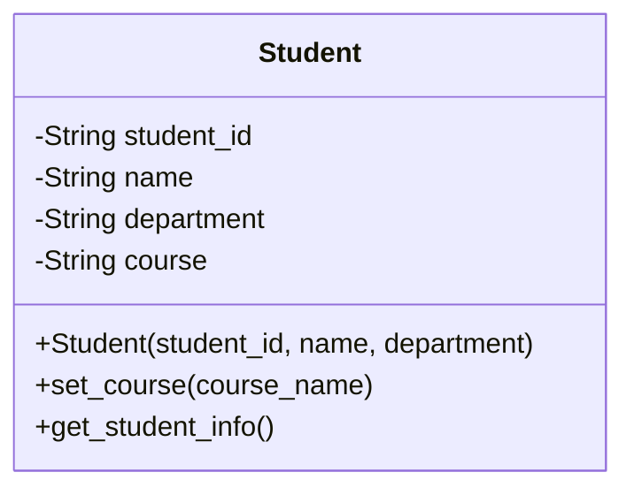

```mermaid
classDiagram
    class Student {
        -String student_id
        -String name
        -String department
        -String course
        +Student(student_id, name, department)
        +set_course(course_name)
        +get_student_info()
    }
```
